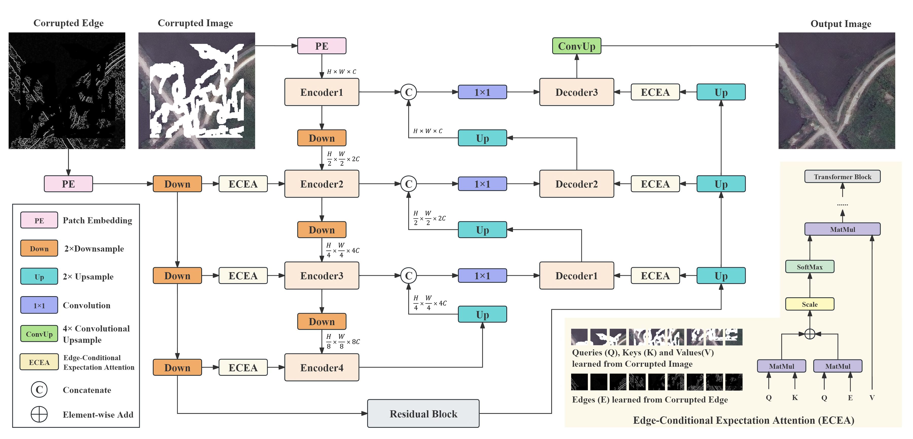
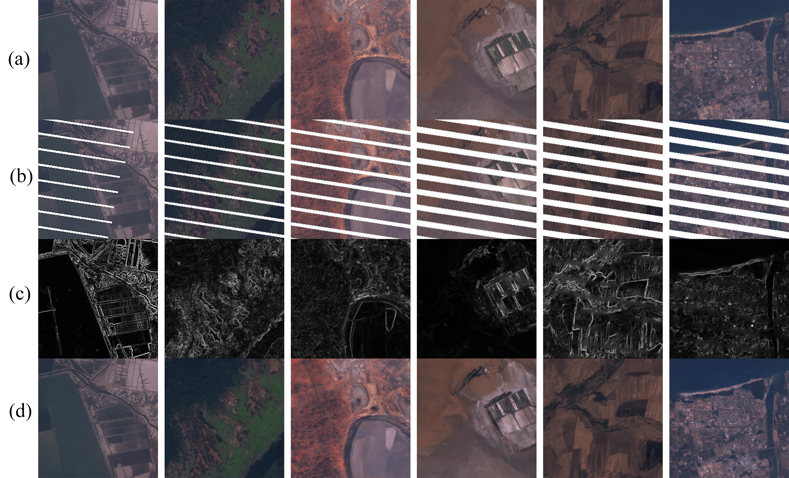
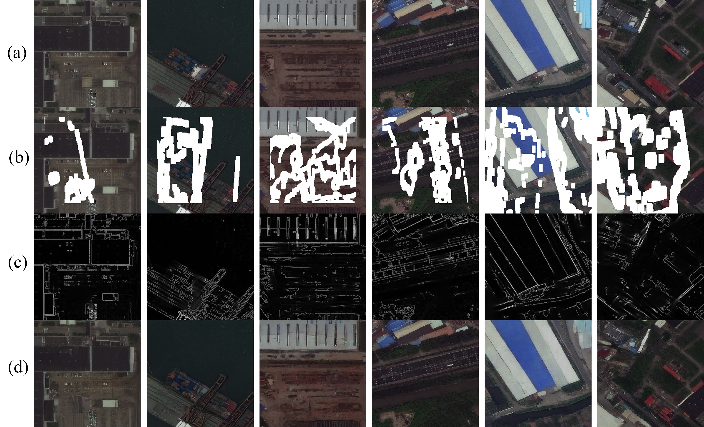
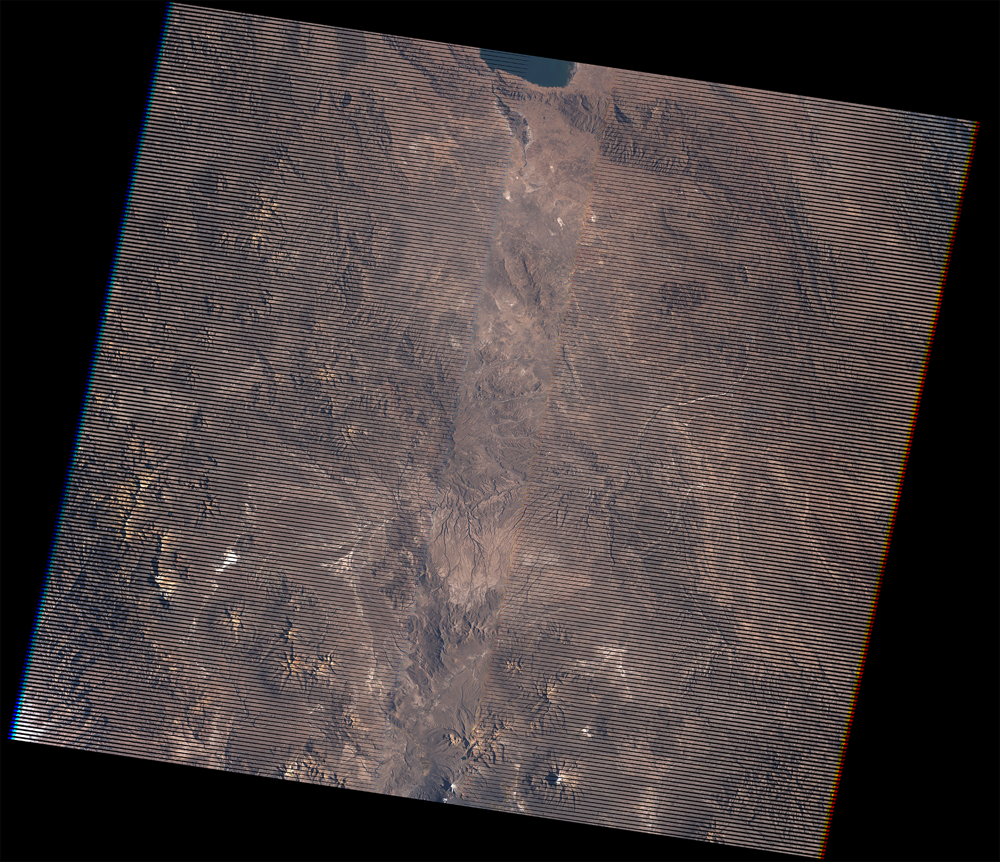
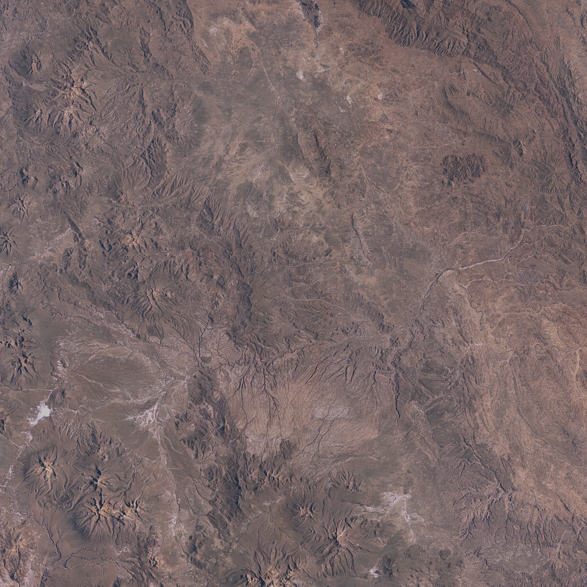

# Satellite Image Inpainting with Edge-Conditional Expectation Attention

This repository contains the implementation of the research paper "Satellite Image Inpainting with Edge-Conditional Expectation Attention". The paper is currently under submission.

## Introduction

We propose an Edge-Conditional Expectation Attention (ECEA) approach that leverages edge information and Chebyshev's inequality to improve satellite image inpainting by capturing long-range dependencies and stabilizing the reconstruction process.

## Requirements

Python >=3.6

PyTorch >=1.6

NVIDIA GPU + CUDA cuDNN

## Installation

1. Clone the repository:

   ```git clone https://github.com/Chowdz/ecea.git```

   ```cd ecea```

2. Install dependencies:

   ```pip install -r requirements.txt```

## Pipeline



## Dataset

we downloaded two datasets: the [LANDSAT/LE07/C02/T1\_TOA collection](https://doi.org/10.1016/j.rse.2017.06.031) and the [SpaceNet/AOI\_4\_Shanghai dataset](https://github.com/SpaceNetChallenge/utilities). The Landsat-7 dataset contains 100 satellite images, each cropped to a size of $5120\times5120$ pixels from the center, covering non-polar regions between latitudes 60°S and 60°N. These images were collected before May 31, 2003, with a spatial resolution of 30 meters and comprising eight spectral bands. We focused on bands B1, B2, and B3, mapping pixel values between 0-0.4 and applying a gamma correction 1.4. To ensure cleaner ground truth images, only images with less than 1\% cloud coverage were selected. Each image was divided into 400 patches of $256\times256$ pixels, covering approximately 38 $km^2$, resulting in a dataset of 40,000 images with diverse geomorphological features. The SpaceNet dataset includes 4,582 satellite images of the Shanghai region, with a spatial resolution of approximately 0.26-0.3 meters. For this dataset, we utilized bands 5, 3, and 2 while resampling each image to a size of $256\times256$ pixels. Both datasets were subjected to 5-fold cross-validation with an 80\%-20\% train-test split. The Landsat-7 dataset utilized the QA\_RADSAT missing pixel layer as a mask, while the SpaceNet dataset employed [irregular masks](https://nv-adlr.github.io/publication/partialconv-inpainting) for evaluation.

## Training

1. Start:

   ```python trainer.py --BATCH_SIZE 10 --EPOCH 1 --N_EPOCH 500 --LR 0.0005 --BETA1 0.95 --BETA2 0.9995 --TRAIN_IMG_ROOT 'home/train' --TRAIN_MASK_ROOT 'home/mask' --TRAIN_RESULT_ROOT 'home/result/' --SAVE_MODEL_ROOT 'home/models/' --IMG_SIZE 256 --IN_C 4 --OUT_C 3 --PATCH_SIZE 4 --EMBED_DIM --DEPTH [1, 2, 3, 4] --NUM_HEADS [1, 2, 4, 8] --ADV_LOSS_WEIGHT 1 --PER_LOSS_WEIGHT 0.5 --STY_LOSS_WEIGHT 10000 --L1_LOSS_WEIGHT 100 --CSHE_LOSS_WEIGHT 80 --SAMPLE_INTERVAL 500```

   Note: The --TRAIN_IMG_ROOT and --TRAIN_MASK_ROOT parameters refer to the folders containing Landsat-7 ETM+ training satellite images and missing pixel masks, respectively. Each image in these folders should have been pre-cut to a size of 256×256 pixels.

2. Tensorboard:

   ```tensorboard --logdir=logs```

## Result

<div style="text-align: center;">
    
    <p>Figure 1: Inpainting results under different mask sizes on Landsat-7 dataset</p>
</div>

<br>

<div style="text-align: center;">
    
    <p>Figure 2: Inpainting results under different mask sizes on SpaceNet dataset</p>
</div>

<br>

## Real Application


### Functionality:

- Automatically downloads and loads the pre-trained model. If you need to download it separately, you can do so from this [EET](https://drive.google.com/uc?export=download&id=1yon1mfSKmjiEAsK-MTebKZclp1GoZj99).

- Loads the landsat-7 ETM+ corrupted satellite image from the specified input path.

- Uses a generator model to repair the damaged image.

- Saves the inpainting image to the specified output folder.


### Output:

The inpainting satellite image will be saved in the specified output folder as two files:

- 'inpainting.tif': The repaired satellite image.

- 'ground_truth.tif': The original damaged image (for comparison).

  

### Raises:

ValueError: If input_path is not a file or output_path is not a directory.


### Steps:

1. ```cd landsat-7_eet/application```

2. ```python main.py --INPUT_IMG_PATH '/home/user/dataset/CorruptedImage.tif' --OUTPUT_IMG_PATH '/home/user/dataset/InpaintingImages/' --VIS_PARAM {'min': 0, 'max': 0.4, 'gamma': 1.4}```

   

### Note:

- INPUT_IMG_PATH(str): Path to the input landsat-7 ETM+ corrupted satellite image, specified to the image file.

- OUTPUT_IMG_PATH(str): Path to the folder where the inpainting satellite image will be saved. The output image will be saved as 'inpainting.tif' and 'ground_truth.tif'.

- VIS_PARAM (dict, optional): Visualization parameters to adjust the display of the input satellite image. This parameter is not recommended for default use.Only use if the downloaded satellite image has not been adjusted for visualization. Suggested parameters: vis_param = {'min': 0, 'max': 0.4, 'gamma': 1.4}

### Application Results Display:

<div style="text-align: center;">
    
    <p>Figure 4: Input</p>
</div>

<br>

<div style="text-align: center;">
    
    <p>Figure 5: Output ground truth</p>
</div>

<br>

<div style="text-align: center;">
    
    <p>Figure 6: Output inpainting</p>
</div>

<br>


## License

This project is licensed under the MIT License - see the [LICENSE](LICENSE) file for details.

## Contact

Feel free to contact us via email [dazhizhou18@gmail.com](dazhizhou18@gmail.com) or GitHub Issues for questions, feedback, or contributions to this project. We appreciate your interest!
